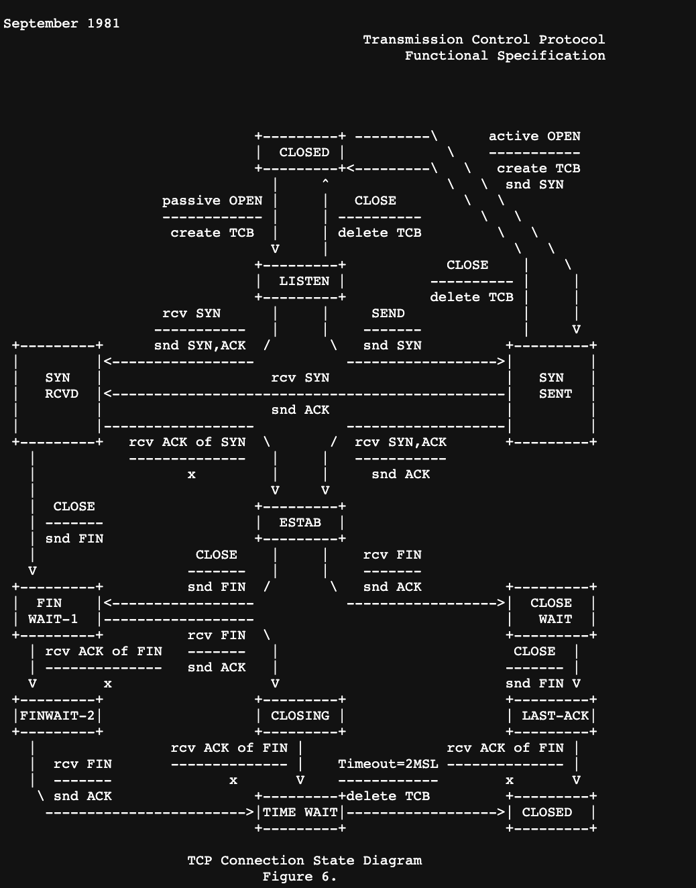

[RFC 793](https://www.ietf.org/rfc/rfc793.txt)
```
# FIX: figure out way to add ip to tun0
docker exec container_id ip addr add 192.168.0.1/24 dev tun0
docker exec container_id ip link set up dev tun0
docker exec container_id ping -I tun0 192.168.0.5
```
